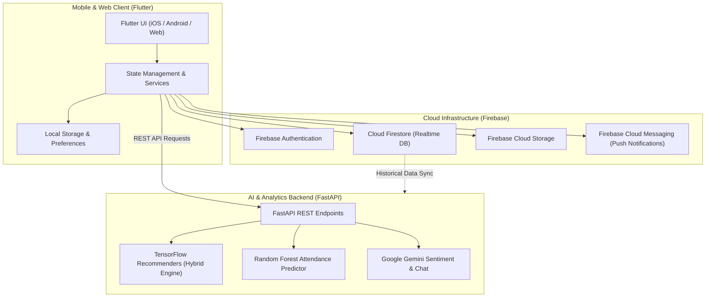

# UniClubs
### AI-Powered University Club and Event Management Platform

[](https://flutter.dev/)
[](https://dart.dev/)
[](https://firebase.google.com/)
[](https://fastapi.tiangolo.com/)
[](https://www.python.org/)
[](https://www.tensorflow.org/recommenders)
[](https://deepmind.google/technologies/gemini/)
[](LICENSE)

UniClubs is an intelligent, cross-platform mobile and web ecosystem engineered to revolutionize campus life, student club administration, and extracurricular event engagement across universities. By integrating state-of-the-art machine learning models with a mobile-first Flutter interface, UniClubs bridges the gap between students seeking enriching campus activities and club organizers optimizing event turnout.

---

## Key Features

### 1. Hybrid Club & Event Recommendations
- Powered by **TensorFlow Recommenders (TFRS)** combining collaborative filtering and content-based features.
- Delivers personalized suggestions based on student interests, major, past attendance, and peer trends.

### 2. Intelligent Attendance & Capacity Prediction
- Employs a **Random Forest regression and classification model** to forecast event turnout.
- Helps organizers predict attendance peaks, prevent overcapacity, and optimize resource allocation (seating, catering, materials).

### 3. Student Feedback Sentiment Analysis
- Uses **Google Gemini API** to process student post-event reviews and surveys in real time.
- Categorizes sentiment (positive, neutral, negative) and extracts key themes to provide club leaders with actionable analytics.

### 4. Interactive AI Campus Assistant
- An in-app conversational assistant helping students discover relevant workshops, check upcoming deadlines, and answer club-related inquiries.

### 5. Seamless Multi-Platform Experience
- Responsive cross-platform interface built with **Flutter** (iOS, Android, and Web).
- Real-time synchronization, push notifications, and authentication managed through **Google Firebase**.

---

## System Architecture



---

## Technology Stack

| Domain | Technology | Purpose |
| :--- | :--- | :--- |
| **Mobile App** | Flutter & Dart | Cross-platform client for iOS and Android |
| **Backend API** | FastAPI (Python) | High-performance asynchronous microservice backend |
| **Database & Auth** | Cloud Firestore & Firebase Auth | Real-time database, user management, and session control |
| **Cloud Storage** | Firebase Cloud Storage | Storage for club assets, logos, and event banners |
| **Push Notifications** | Firebase Cloud Messaging (FCM) | Instant updates on event announcements and reminders |
| **Recommendation Engine**| TensorFlow Recommenders | Dual-tower collaborative and content-based recommendation |
| **Predictive Modeling** | Scikit-Learn (Random Forest) | Pre-event attendance forecasting and capacity planning |
| **LLM & Sentiment** | Google Gemini API | Automated feedback analysis and student assistant |

---

## Repository Structure

```
uniclubs/
├── lib/                        # Flutter Application Source
│   ├── firebase_options.dart   # Firebase configuration
│   ├── main.dart               # App entrypoint
│   ├── models/                 # Data models (User, Club, Event)
│   ├── screens/                # UI Views (Home, Discover, Events, Profile)
│   ├── services/               # API clients, Firebase services, ML integration
│   └── utils/                  # UI themes, helpers, and constants
├── backend/                    # Python ML & Analytics Backend
│   ├── app/                    # FastAPI application routers and schemas
│   ├── ml_models/              # Trained weights and inference pipelines
│   ├── notebooks/              # Model training, exploratory data analysis
│   └── requirements.txt        # Backend Python dependencies
├── android/                    # Native Android configurations
├── ios/                        # Native iOS configurations
├── web/                        # Flutter web support
├── test/                       # Flutter unit and widget tests
├── pubspec.yaml                # Flutter package dependencies
├── LICENSE                     # Official MIT Open Source License
└── README.md                   # Documentation
```

---

## Installation and Quickstart

### Prerequisites
- [Flutter SDK](https://flutter.dev/docs/get-started/install) (v3.19+)
- [Dart SDK](https://dart.dev/get-dart)
- [Python](https://www.python.org/downloads/) 3.10 or higher
- A configured [Firebase Project](https://console.firebase.google.com/)

### 1. Mobile Application Setup (Flutter)
```bash
# Clone the repository
git clone https://github.com/Bariqa1/Uniclubs.git
cd uniclubs

# Install Flutter dependencies
flutter pub get

# Run the app on an active simulator or device
flutter run
```

### 2. Backend Setup (FastAPI & ML Services)
```bash
cd backend

# Create and activate a Python virtual environment
python3 -m venv .venv
source .venv/bin/activate  # On Windows: .venv\Scripts\activate

# Install dependencies
pip install -r requirements.txt

# Configure environment variables
cp .env.example .env
# Edit .env and supply GEMINI_API_KEY and other configuration values

# Start the development server
uvicorn app.main:app --reload --port 8000
```

---

## Team & Credits

This project was developed as a University Graduation Project:

- **Bariqa** - [GitHub](https://github.com/Bariqa1)
- **Rudi** - [GitHub](https://github.com/meisru)
- **Asma** - [GitHub](https://github.com/AsmaFh241)
- **Gori** - [GitHub](https://github.com/JoJ04)

---

## License & Copyright

Copyright (c) 2026 UniClubs Contributors. All Rights Reserved.

This repository and its codebase are made available for portfolio, demonstration, and academic review purposes only. No part of this software, source code, or documentation may be reproduced, distributed, modified, sublicensed, or used for commercial purposes without prior explicit written permission from the copyright holders.
